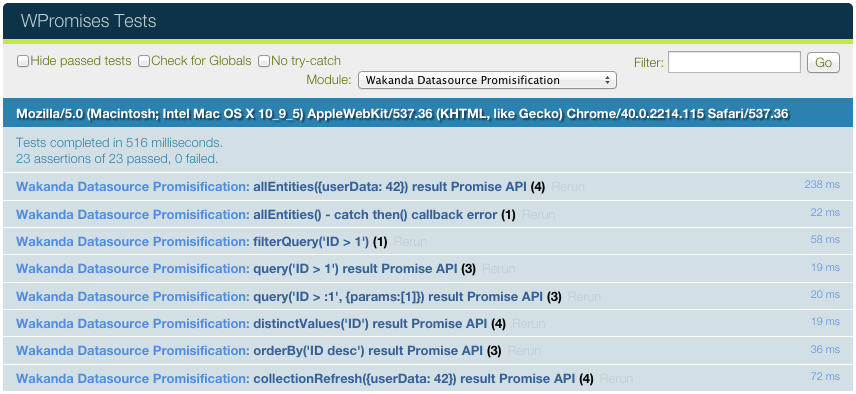

# QUnit Widget for [Wakanda](http://wakanda.org)

 

The QUnit widget allows you to run [QUnit](http://qunitjs.com) unit test suites from your frontend (Pages, Components, Custom Widgets, ..) 
and show their results.

Custom Widgets code can be independentily tested in designer (from the Wakanda GUI Designer) and runtime mode.



## How to Install

You can install a custom widget by using the Wakanda Studio [Add-ons Extension](http://doc.wakanda.org/WakandaStudio/help/Title/en/page4263.html "Add-ons Extension"). 

For more information, refer to the [Installing a Custom Widget](http://doc.wakanda.org/WakandaStudio/help/Title/en/page3869.html#1056003 "Installing a Custom Widget") manual.

## How to Use

Drag & drop the `QUnit` Widget on your Wakanda Page. It will automatically listen for any executed QUnit tests.

QUnit test examples:

```
QUnit.module( "module a" );

QUnit.test( "a basic test example", function( assert ) {
  assert.ok( true, "this test is fine" );
});

QUnit.test( "a basic test example that fail", function( assert ) {
  assert.ok( false, "this test is not fine" );
});
 

QUnit.module( "module b" );

QUnit.test( "a basic async test example", function( assert ) {
  var done = assert.async();
  assert.expect(1);
  setTimeout(function () {
  	assert.ok( true, "this test is fine" );
  	done();
  }, 1000);
});

QUnit.test( "a basic promise test example", function() {
  assert.expect(1);
  return new Promise(function (resolve, reject) {
    assert.ok( true, "this test is fine" );
    resolve();
  });
});
```

## About Wakanda Custom Widgets

For more information about creating a custom widget, refer to the [Widgets v2 Creating a Widget](http://doc.wakanda.org/Wakanda/help/Title/en/page3849.html "Widgets v2 Creating a Widget") manual.


## License

Copyright 2015 Alexandre Morgaut

This widget is available under the [Mozilla Public License v2.0](https://www.mozilla.org/MPL/2.0/)

It allows usage of this widget with either:

* a modified *BSD* license (a bit *MIT* oriented),
* the GNU General Public License, Version 2.0 (*GPLv2*), 
* the GNU Lesser General Public License, Version 2.1 (*LGPLv2.1*), 
* the GNU Affero General Public License, Version 3.0 (*AGPLv3*), 
* or any later versions of those licenses

More informations about the ["Mozilla Public License" on Wikipedia](http://en.wikipedia.org/wiki/Mozilla_Public_License)
